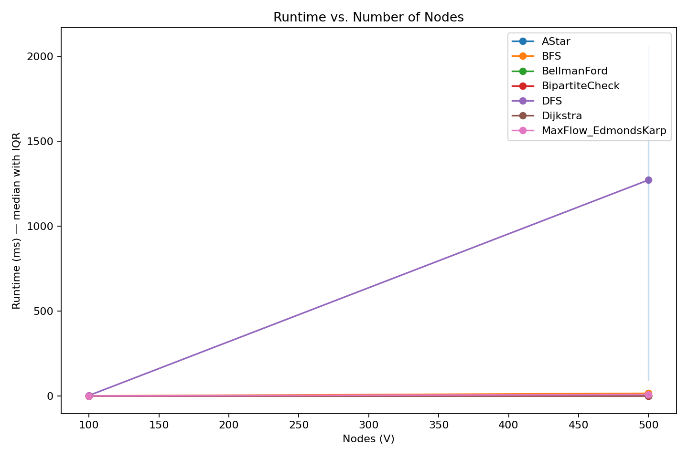
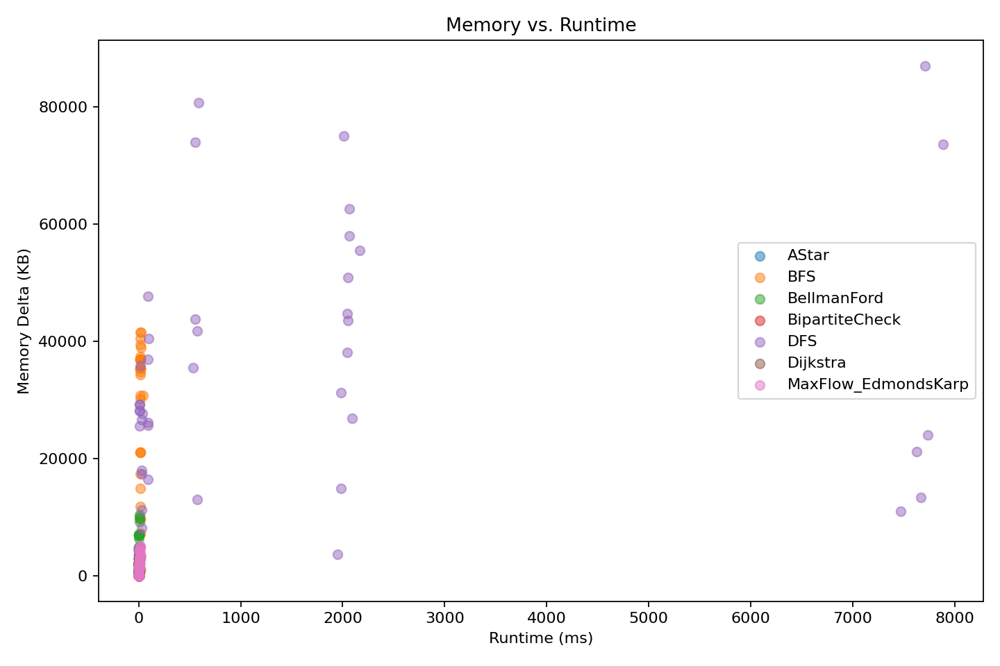

# Graph Algorithms Benchmark

A comprehensive Java project benchmarking classical graph algorithms (BFS, DFS, Dijkstra, Bellman-Ford, A*, Max Flow, Bipartite Check) on various graph sizes and densities. Includes result analysis with Python plots and an interactive Streamlit dashboard to visualize algorithm performance.


## 📊 Overview

This project systematically evaluates the performance of fundamental graph algorithms across different graph structures, providing insights into their time complexity, memory usage, and scalability characteristics. The benchmark generates comprehensive datasets and visualizations to help researchers and developers understand algorithm behavior in practical scenarios.

## 🚀 Features

### Implemented Algorithms
- **Traversal Algorithms**: BFS, DFS
- **Shortest Path Algorithms**: Dijkstra, Bellman-Ford, A* Search
- **Flow Algorithms**: Maximum Flow (Edmonds-Karp)
- **Graph Property Algorithms**: Bipartite Graph Check

### Benchmarking Capabilities
- Generate graphs of arbitrary size and density
- Measure execution time with nanosecond precision
- Track memory usage during algorithm execution
- Support for both weighted and unweighted graphs
- Customizable graph generation parameters

### Visualization & Analysis
- Python analysis scripts with Matplotlib/Seaborn
- Interactive Streamlit dashboard
- Comparative performance charts
- Scalability analysis across graph sizes
- Memory-Runtime tradeoff visualizations

## 🛠 Installation

### Prerequisites
- Java 17 or higher
- Python 3.8 or higher
- Maven (for dependency management)

### Clone the Repository
```bash
git clone https://github.com/harsharajkumar/graph-algorithms-benchmark.git
cd graph-algorithms-benchmark
```

### Java Setup
Compile the Java source files:

```bash
javac -d bin src/algorithms/*.java src/utils/*.java src/experiments/*.java
```

Alternatively, use Maven to build the project:

```bash
mvn clean compile
```

### Python Dependencies
Install required Python packages for analysis:

```bash
pip install -r analysis/requirements.txt
```

## 📖 Usage

### Running Java Benchmarks
Execute the comprehensive benchmark suite:

```bash
java -cp bin experiments.GraphAlgorithmBenchmarkVerbose
```

Run specific algorithm tests:

```bash
# Test BFS performance
java -cp bin experiments.BFSBenchmark

# Test Dijkstra performance
java -cp bin experiments.DijkstraBenchmark
```

### Configuration Options
Modify `config/benchmark.properties` to customize:

- Graph sizes (number of nodes)
- Graph densities (edge probabilities)
- Number of test iterations
- Output file locations

### Python Analysis
Generate performance visualizations:

```bash
python analysis/bench_analysis.py
```

### Streamlit Dashboard
Launch the interactive dashboard:

```bash
streamlit run analysis/streamlit_app.py
```

## 📈 Results & Visualizations

### Performance Analysis


*Figure 1: Algorithm runtime scaling with increasing graph size*


*Figure 2: Memory consumption relative to execution time*


*Figure 3: Comparative performance of all algorithms on dense graphs*

### Key Findings
- Dijkstra outperforms Bellman-Ford on sparse graphs but has similar complexity on dense graphs
- A* shows significant improvement over Dijkstra with good heuristics
- BFS/DFS have linear complexity with respect to graph size
- Edmonds-Karp demonstrates cubic complexity in worst-case scenarios
- Memory usage correlates strongly with algorithm time complexity

## 🎛 Streamlit Dashboard

The interactive dashboard provides real-time exploration of algorithm performance metrics.


*Interactive dashboard for exploring algorithm performance*

### Dashboard Features
- Dynamic filtering by algorithm and graph type
- Interactive performance charts
- Side-by-side algorithm comparisons
- Export functionality for results
- Configurable display options

## 📁 Project Structure

```
graph-algorithms-benchmark/
├── src/                          # Java source code
│   ├── algorithms/               # Algorithm implementations
│   │   ├── BFS.java
│   │   ├── DFS.java
│   │   ├── Dijkstra.java
│   │   ├── BellmanFord.java
│   │   ├── AStar.java
│   │   ├── EdmondsKarp.java
│   │   └── BipartiteCheck.java
│   ├── experiments/              # Benchmarking code
│   │   ├── GraphAlgorithmBenchmarkVerbose.java
│   │   ├── BFSBenchmark.java
│   │   └── ...
│   ├── utils/                    # Utility classes
│   │   ├── GraphGenerator.java
│   │   ├── PerformanceMetrics.java
│   │   └── ResultLogger.java
│   └── main/                     # Main application class
│       └── Main.java
├── analysis/                     # Python analysis code
│   ├── bench_analysis.py         # Main analysis script
│   ├── streamlit_app.py          # Streamlit dashboard
│   ├── requirements.txt          # Python dependencies
│   └── figures/                  # Generated visualizations
├── results/                      # Benchmark results (CSV format)
├── config/                       # Configuration files
│   └── benchmark.properties
├── docs/                         # Additional documentation
├── pom.xml                       # Maven configuration
└── README.md
```

## 🔧 Advanced Configuration

### Custom Graph Generation
Modify `GraphGenerator.java` to create specialized graph structures:

```java
// Generate scale-free network
Graph scaleFreeGraph = GraphGenerator.generateScaleFreeGraph(1000, 3);

// Generate small-world network
Graph smallWorldGraph = GraphGenerator.generateSmallWorldGraph(500, 10, 0.1);
```

### Adding New Algorithms
1. Implement the algorithm in `src/algorithms/`
2. Create a benchmark class in `src/experiments/`
3. Add to the main benchmark suite in `GraphAlgorithmBenchmarkVerbose.java`
4. Update visualization scripts to include the new algorithm

### Memory Profiling
Enable detailed memory tracking by setting:

```java
PerformanceMetrics.setDetailedMemoryTracking(true);
```

## 🤝 Contributing

We welcome contributions to enhance this benchmark suite!

### How to Contribute
1. Fork the repository
2. Create a feature branch (`git checkout -b feature/amazing-feature`)
3. Commit your changes (`git commit -m 'Add amazing feature'`)
4. Push to the branch (`git push origin feature/amazing-feature`)
5. Open a Pull Request

### Areas for Contribution
- Additional graph algorithms (e.g., Floyd-Warshall, Kruskal's)
- New graph generation models
- Enhanced visualization techniques
- Performance optimization
- Documentation improvements

### Reporting Issues
Please use the GitHub issue tracker to report bugs or suggest enhancements.

## 📝 License

This project is licensed under the MIT License - see the [LICENSE](LICENSE) file for details.# graph-algorithms-benchmark
